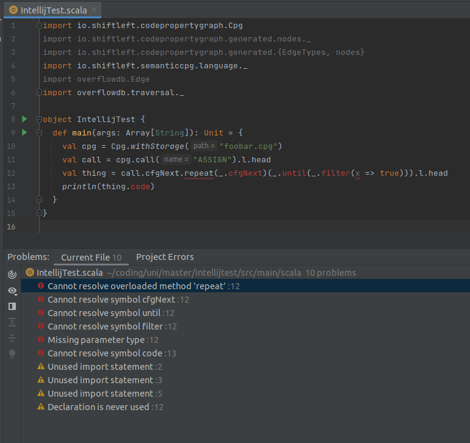

# Example for problems with Intellij and shiftleft/codepropertygraph



Compiles and runs just fine.

```
IntelliJ IDEA 2021.3.1 (Ultimate Edition)
Build #IU-213.6461.79, built on December 28, 2021
Licensed to [myself]
Subscription is active until [XXX]
For educational use only.
Runtime version: 11.0.13+7-b1751.21 amd64
VM: OpenJDK 64-Bit Server VM by JetBrains s.r.o.
Linux 5.13.0-22-generic
GC: G1 Young Generation, G1 Old Generation
Memory: 2048M
Cores: 4
Registry:
    scala.erase.compiler.process.jdk.once=false

Non-Bundled Plugins:
    Key Promoter X (2021.3)
    com.jetbrains.php (213.6461.79)
    org.intellij.scala (2021.3.17)

Kotlin: 213-1.6.10-release-923-IJ5744.223
Current Desktop: ubuntu:GNOME
```
